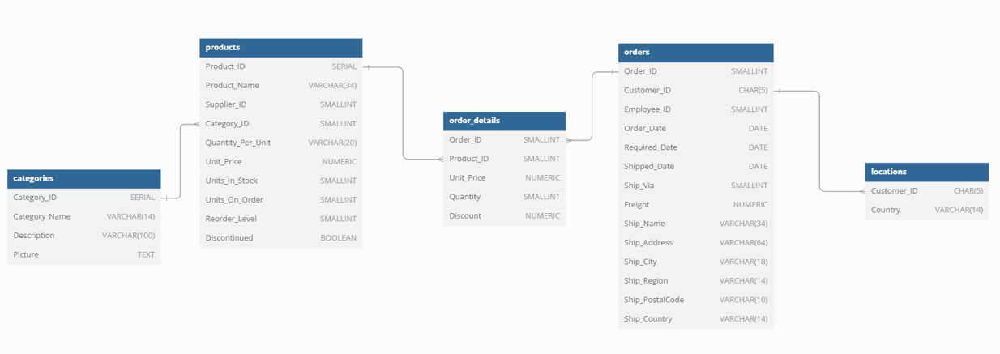

# Python-Project-Analyzing-Northwind-Data (In Progress)

## **1. Prpduct Analysis**

### **Intro**
Northwind Traders is a fictitious company created by Microsoft for the purposes of demonstrating the database capabilities of Microsoft Access and then later for SQL 
Server. Since then, it has also been used by numerous companies as a sample database to demonstrate how their development tools work. Northwind database consists of
8 tables which are customers, employees, suppliers, shippers, categories, products, orders and order-details in resemblance of typlical supply chain company business.
In this project, I used Northwind database to answer various business questions that may occur in real project. The time frame of the database is between 1994 and 1996,
however, the business questions and the querying methods are very relevant to the current business environment.

### **Problem Statement**

We need to optimize our product portfolio to maximize sales and profitability. Currently, we lack clear insights into product performance, popularity, and contribution to overall revenue. To address this, we will analyze:  

- Total revenue and total quantity sold by each product category  
- Total revenue and total quantity sold for the top 10 products by revenue  
- Average monthly demand for the top 10 products by revenue  
- Bottom 10 products by revenue  
- Top 10 products by total revenue and total quantity for each category  
- Bottom products by revenue for each category (maximum of 10)  
- Categories by total revenue and total quantity for the top 3 countries by revenue  
- Top product by revenue for the top 3 categories by revenue for the top 3 countries by revenue  
- Product ABC analysis  
- Average growth rate for the top 10 products by revenue  
- Product discount analysis  

### **Objectives  **

- Analyze product demand patterns and trends over time  
- Evaluate the profitability of each product  
- Identify products at different stages of their life cycle  
- Categorize products based on their contribution to revenue (ABC analysis)  
- Evaluate the impact of the discount on revenue  

This analysis will provide data-driven insights to enhance product portfolio optimization and drive strategic decision-making.

## **2. Suppliers Analysis**
(In Progress)

## **Data Model**

## **Data Dictionary**

### products
| Column Name     | Data Type | Description                                    |
|-----------------|-----------|------------------------------------------------|
| ProductName     | String    | Name of the product                            |
| SupplierID      | Integer   | Unique identifier for the supplier             |
| CategoryID      | Integer   | Unique identifier for the category             |
| QuantityPerUnit | String    | Quantity of the product per unit               |
| UnitPrice       | Float     | Price per unit of the product                  |
| UnitsInStock    | Integer   | Number of units currently in stock             |
| UnitsOnOrder    | Integer   | Number of units currently on order             |
| ReorderLevel    | Integer   | Minimum number of units before reorder         |
| Discontinued    | Boolean   | Indicates if the product is discontinued (TRUE/FALSE) |

### categories
| Column Name  | Data Type | Description                                    |
|--------------|-----------|------------------------------------------------|
| CategoryName | String    | Name of the category                           |
| Description  | String    | Description of the category                    |

### orders
| Column Name    | Data Type | Description                                    |
|----------------|-----------|------------------------------------------------|
| OrderID        | Integer   | Unique identifier for the order                |
| CustomerID     | String    | Unique identifier for the customer             |
| EmployeeID     | Integer   | Unique identifier for the employee             |
| OrderDate      | Date      | Date when the order was placed                 |
| RequiredDate   | Date      | Date by which the order is required            |
| ShippedDate    | Date      | Date when the order was shipped                |
| ShipVia        | Integer   | Shipping method identifier                     |
| Freight        | Float     | Freight cost for the order                     |
| ShipName       | String    | Name of the shipper                            |
| ShipAddress    | String    | Shipping address                               |
| ShipCity       | String    | Shipping city                                  |
| ShipRegion     | String    | Shipping region                                |
| ShipPostalCode | String    | Shipping postal code                           |
| ShipCountry    | String    | Shipping country                               |

### order_details
| Column Name | Data Type | Description                                    |
|-------------|-----------|------------------------------------------------|
| OrderID     | Integer   | Unique identifier for the order                |
| ProductID   | Integer   | Unique identifier for the product              |
| UnitPrice   | Float     | Price per unit of the product at the time of the order |
| Quantity    | Integer   | Quantity of the product ordered                |
| Discount    | Float     | Discount applied to the product                |

### locations
| Column Name   | Data Type | Description                                      |
|---------------|-----------|--------------------------------------------------|
| CustomerID    | String    | Unique identifier for the customer               |
| Country       | String    | Country where the customer is located            |

